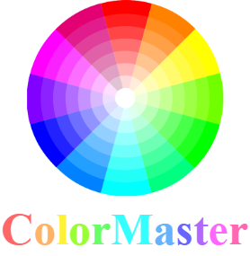

<!-- markdownlint-disable no-inline-html -->
<!-- markdownlint-disable first-line-heading -->
<div align="center">
  <a href="https://github.com/lbragile/ColorMaster">
    
  </a>
</div>

<div align="center">
  <a href="https://www.npmjs.com/package/colormaster">
    
  </a>
  <a href="https://www.npmjs.com/package/colormaster">
    
  </a>
   <a href="https://www.npmjs.com/package/colormaster">
    
  </a>
  <a href="https://github.com/lbragile/ColorMaster/actions">
    
  </a>
  <a href="https://codecov.io/gh/lbragile/ColorMaster">
    
  </a>
  <a href="https://www.codefactor.io/repository/github/lbragile/colormaster">
    
  </a>
</div>

<div align="center">
  <strong>ColorMaster</strong> is a powerful and fully typed module for all your coloring needs.
</div>
<!-- markdownlint-enable first-line-heading -->
<!-- markdownlint-enable no-inline-html -->

## 💎 Features

- 📦 **Compact**: Just ~2.5 KB [minified & gzipped](https://bundlephobia.com/package/colormaster@latest)
- 👌 **Straightforward**: Clear & intuitive function names with chainable API
- 🔫 **Bulletproof**: Entirely TypeScript (strict mode) and very thoroughly tested
- ✍ **Strongly Typed**: Includes [types](#-strongly-typed) out of the box
- 🏗 **Extendable**: [Plugins](#-general-plugins) allow you to extend upon core functionality as needed
- 🌳 **Tree Shakable**: Only adds functions that you use to reduce your project's size
- 📑 **CSS Compliant**: Adheres to [CSS color](https://developer.mozilla.org/en-US/docs/Web/CSS/color_value) specifications
- 🚂 **Works Everywhere**: Browser (client) and NodeJS (server) support
- 🐣 **Dependency Free**: Full control of features & enhancements

&nbsp;

## ⭐ Getting Started

```markdown
npm install colormaster
```

Then simply start using **ColorMaster** in your project:

<!-- markdownlint-disable no-inline-html -->
<details open>
<summary><b>RGBA</b> Color Space</summary>

```ts
// note that the import name can be anything (default export), we use "CM" for brevity
import CM from "colormaster";

// object argument
CM({ r: 128, g: 128, b: 128, a: 0.5 }).stringRGB(); // "rgba(128, 128, 128, 0.5)"
CM({ r: 128, g: 128, b: 128, a: 0.5 }).stringRGB({ alpha: false }); // "rgb(128, 128, 128)"
CM({ r: 128, g: 128, b: 128, a: 0.5 }).alphaTo(0.8).stringRGB(); // "rgba(128, 128, 128, 0.8)"

// string argument
CM("rgba(128, 128, 128, 0.5)").stringRGB(); // "rgba(128, 128, 128, 0.5)"
CM("rgba(128, 128, 128, 0.5)").stringRGB({ alpha: false }); // "rgb(128, 128, 128)"
CM("rgba(128, 128, 128, 0.5)").alphaTo(0.8).stringRGB(); // "rgba(128, 128, 128, 0.8)"
CM("rgba(128, 128, 128, 0.5)").stringRGB(); // "rgba(128, 128, 128, 0.5)"
CM("rgba(50%, 50%, 50%, 50%)").stringRGB(); // "rgba(128, 128, 128, 0.5)"
CM("rgba(50% 50% 50% 50%)").stringRGB(); // "rgba(128, 128, 128, 0.5)"
CM("rgba(50% 50% 50% / 50%)").stringRGB(); // "rgba(128, 128, 128, 0.5)"
CM("rgba(50% 50% 50% / 0.5)").stringRGB(); // "rgba(128, 128, 128, 0.5)"
```

</details>

<details>
<summary><b>HSLA</b> Color Space</summary>

```ts
import CM from "colormaster";

// object argument
CM({ h: 300, s: 50, l: 60, a: 0.5 }).stringHSL(); // "hsla(300, 50%, 60%, 0.5)"
CM({ h: 300, s: 50, l: 60, a: 0.5 }).stringHSL({ alpha: false }); // "hsl(300, 50%, 60%)"
CM({ h: 300, s: 50, l: 60, a: 0.5 }).alphaTo(0.8).stringHSL(); // "hsla(300, 50%, 60%, 0.8)"

// string argument
CM("hsla(300, 50%, 60%, 0.5)").stringHSL(); // "hsla(300, 50%, 60%, 0.5)"
CM("hsla(300, 50%, 60%, 0.5)").stringHSL({ alpha: false }); // "hsl(300, 50%, 60%)"
CM("hsla(300, 50%, 60%, 0.5)").alphaTo(0.8).stringHSL(); // "hsla(300, 50%, 60%, 0.8)"
CM("hsla(50%, 50%, 60%, 50%)").stringHSL(); // "hsla(180, 50%, 60%, 0.5)"
CM("hsla(50% 50% 60% 50%)").stringHSL(); // "hsla(180, 50%, 60%, 0.5)"
CM("hsla(50% 50% 60% / 50%)").stringHSL(); // "hsla(180, 50%, 60%, 0.5)"
CM("hsla(50% 50% 60% / 0.5)").stringHSL(); // "hsla(180, 50%, 60%, 0.5)"
```

</details>

<details>
<summary><b>HEXA</b> Color Space</summary>

```ts
import CM from "colormaster";

// object argument
CM({ r: "45", g: "67", b: "89", a: "AB" }).stringHEX(); // "#456789AB"
CM({ r: "45", g: "67", b: "89", a: "AB" }).stringHEX({ alpha: false }); // "#456789"
CM({ r: "45", g: "67", b: "89", a: "AB" }).alphaTo("CC").stringHEX(); // "#456789CC"

// string argument
CM("#456789AB").stringHEX(); // "#456789AB" ← 8-Digit Hex Input
CM("#456789").stringHEX(); // "#456789FF" ← 6-Digit Hex Input
CM("#4567").stringHEX(); // "#44556677" ← 4-Digit Hex Input
CM("#456").stringHEX(); // "#445566FF" ← 3-Digit Hex Input
CM("#456789AB").stringHEX({ alpha: false }); // "#456789"
CM("#456789AB").alphaTo("CC").stringHEX(); // "#456789CC"
```

**Note:** HEXA string are always returned in _upperCase_ by **ColorMaster**. If you prefer _lowerCase_ strings,
you can simply use (chain) the built in `toLowerCase()`. More information is available [here](https://developer.mozilla.org/en-US/docs/Web/JavaScript/Reference/Global_Objects/String/toLowerCase)

</details>
<br/>

<!-- markdownlint-enable no-inline-html -->

**Note:** Many more color spaces are provided via [plugins](#-color-space-plugins) to make **ColorMaster** compact.

&nbsp;

## 🔥 API

### Object Instantiation (Color Generation)

<!-- markdownlint-disable no-inline-html -->

<details>
<summary><code>ColorMaster(color)</code></summary>

Parses a given input color so that **ColorMaster** can perform necessary operations to manipulate/transform that input

```ts
import CM from "colormaster";

CM("rgba(255, 0, 0, 1)").stringRGB(); // "rgba(255, 0, 0, 1.0)"
CM({ r: 255, g: 0, b: 0, a: 1 }).stringRGB(); // "rgba(255, 0, 0, 1.0)"

CM("hsla(120, 100%, 50%, 1)").stringHSL(); // "hsla(120, 100%, 50%, 1.0)"
CM({ h: 120, s: 100, l: 50, a: 1 }).stringHSL(); // "hsla(120, 100%, 50%, 1.0)"

// Supports 3-digit, 4-digit, 6-digit, and 8-digit HEX(A) input.
CM("#456789").stringHEX(); // "#456789FF"
CM({ r: "45", g: "67", b: "89", a: "AB" }).stringHEX(); // "#456789AB"

// requires name plugin
import CM, { extendPlugins } from "colormaster";
import NamePlugin from "colormaster/plugins/name";

extendPlugins([NamePlugin]);

CM("red").stringHEX(); // "#FF0000FF"
```

</details>

<details>
<summary><code>random()</code></summary>

Generates a random RGBA color.

```ts
import { random } from "colormaster";

random().stringRGB(); // "rgba(255, 0, 0, 1.0)"
random()().stringHSL(); // "hsla(0, 100%, 50%, 1.0)"
random().stringHEX(); // "#FF0000FF"
```

</details>

<!-- markdownlint-enable no-inline-html -->

&nbsp;

### Formatting

<!-- markdownlint-disable no-inline-html -->

<details>
<summary><code>stringRGB(opts?)</code></summary>

Generates a human readable RGBA color space string from a given color instance

```ts
import CM from "colormaster";
CM("rgba(255, 0, 0, 1)").stringRGB(); // "rgba(255, 0, 0, 1)"
CM("rgba(255, 0, 0, 1)").stringRGB({ alpha: false }); // "rgba(255, 0, 0)"
CM("rgba(200.1234, 100.1234, 50.1234, 0.61234)").stringRGB({ precision: [1, 2, 3, 4] }); // "rgba(200.1, 100.12, 50.123, 0.6123)"
```

</details>

<details>
<summary><code>stringHEX(opts?)</code></summary>

Generates a human readable HEXA color space string from a given color instance

Note: this method always returns an 8-digit hex string (you do not need to/cannot specify precision)

```ts
import CM from "colormaster";
CM("rgba(255, 0, 0, 1)").stringHEX(); // "#FF0000FF"
CM("rgba(255, 0, 0, 1)").stringHEX({ alpha: false }); // "#FF0000"
```

</details>

<details>
<summary><code>stringHSL(opts?)</code></summary>

Generates a human readable HSLA color space string from a given color instance

```ts
import CM from "colormaster";
CM("rgba(255, 0, 0, 1)").stringHSL(); // "hsl(0, 100%, 50%, 1)"
CM("rgba(255, 0, 0, 1)").stringHSL({ alpha: false }); // "hsl(0, 100%, 50%)"
CM("hsla(200.1234, 75.1234, 50.1234, 0.61234)").stringHSL({ precision: [1, 2, 3, 4] }); // "hsla(200.1, 100.12%, 50.123%, 0.6123)"
```

</details>

<details>
<summary><code>name()</code> (<b>name</b> plugin)</summary>

Gets the color table <a href='https://www.rapidtables.com/web/color/RGB_Color.html'>CSS/HTML name</a> for a given color

```ts
import CM from "colormaster";
CM("rgba(255, 0, 0, 1)").name(); // "red"
CM("rgba(0, 255, 0, 1)").name(); // "green"
CM("rgba(0, 0, 255, 1)").name(); // "blue"
```

</details>
<br/>
<!-- markdownlint-enable no-inline-html -->

**Note:** More color space string formation methods (`string<COLOR-SPACE>`) are available with each [Color Space Plugin](#-color-space-plugins).

&nbsp;

### Channel/Instance Level Information

<!-- markdownlint-disable no-inline-html -->

<details>
<summary><code>format</code></summary>

Retrieve the format of color instance (what is the color space)

```ts
import CM from "colormaster";
CM("rgba(255, 0, 0, 1)").format; // "rgb"
```

</details>

<details>
<summary><code>red</code></summary>

Get the "red" channel value for the color instance.

```ts
import CM from "colormaster";
CM("rgba(255, 0, 0, 1)").red; // 255
CM("hsla(0, 100%, 50%, 1)").red; // 255
CM("#F00F").red; // "FF"
```

</details>

<details>
<summary><code>green</code></summary>

Get the "green" channel value for the color instance.

```ts
import CM from "colormaster";
CM("rgba(0, 255, 0, 1)").green; // 255
CM("hsla(120, 100%, 50%, 1)").green; // 255
CM("#0F0F").green; // "FF"
```

</details>

<details>
<summary><code>blue</code></summary>

Get the "blue" channel value for the color instance.

```ts
import CM from "colormaster";
CM("rgba(0, 0, 255, 1)").blue; // 255
CM("hsla(240, 100%, 50%, 1)").blue; // 255
CM("#00FF").blue; // "FF"
```

</details>

<details>
<summary><code>alpha</code></summary>

Get the "alpha" channel value for the color instance.

```ts
import CM from "colormaster";
CM("rgba(0, 0, 255, 1)").alpha; // 1
CM("hsla(240, 100%, 50%, 1)").alpha; // 1
CM("#FF0F").alpha; // "FF"
```

</details>

<details>
<summary><code>hue</code></summary>

Get the "hue" channel value for the color instance.

```ts
import CM from "colormaster";
CM("rgba(0, 0, 255, 1)").hue; // 240
CM("hsla(240, 100%, 50%, 1)").hue; // 240
CM("#00F").hue; // 240
```

</details>

<details>
<summary><code>saturation</code></summary>

Get the "saturation" channel value for the color instance.

```ts
import CM from "colormaster";
CM("rgba(0, 0, 255, 1)").saturation; // 100
CM("hsla(240, 100%, 50%, 1)").saturation; // 100
CM("#00F").saturation; // 100
```

</details>

<details>
<summary><code>lightness</code></summary>

Get the "lightness" channel value for the color instance.

```ts
import CM from "colormaster";
CM("rgba(0, 0, 255, 1)").lightness; // 50
CM("hsla(240, 100%, 50%, 1)").lightness; // 50
CM("#00F").lightness; // 50
```

</details>

<!-- markdownlint-enable no-inline-html -->

&nbsp;

### Objects From Color Instance

<!-- markdownlint-disable no-inline-html -->

<details>
<summary><code>rgba()</code></summary>

Retrieve the object corresponding to the color instance

```ts
import CM from "colormaster";
CM("rgba(255, 0, 0, 1)").rgba(); // "{ r: 255, g: 0, b: 0, a: 1 }"
```

</details>

<details>
<summary><code>hsla()</code></summary>

Retrieve the object corresponding to the color instance

```ts
import CM from "colormaster";
CM("rgba(255, 0, 0, 1)").hsla(); // "{ h: 0, s: 100, l: 50, a: 1 }"
```

</details>

<details>
<summary><code>hexa(opts?)</code></summary>

Retrieve the object corresponding to the color instance

```ts
import CM from "colormaster";
CM("rgba(255, 0, 0, 1)").hexa(); // "{ r: "FF", g: "00", b: "00", a: "FF" }"
```

</details>
<br/>
<!-- markdownlint-enable no-inline-html -->

**Note:** More color space object formation methods (`<color-space>a`) are available with each [Color Space Plugin](#-color-space-plugins).

&nbsp;

### Manipulation

<!-- markdownlint-disable no-inline-html -->

<details>
<summary><code>hueTo(value | cssName)</code></summary>

Changes the "hue" channel value TO a given input value (done in HSLA space and converted back to RGBA space)

```ts
import CM from "colormaster";
CM("rgba(255, 0, 0, 1)").hueTo(120).stringRGB(); // "rgba(0, 255, 0, 1.0)"
CM("hsla(0, 100%, 50%, 1)").hueTo(120).stringHSL(); // "hsla(120, 100%, 50%, 1.0)"
CM("#f00").hueTo("green").stringHEX(); // "#00FF00FF"
```

</details>

<details>
<summary><code>hueBy(delta)</code></summary>

Changes the "hue" channel value BY a given delta (done in HSLA space and converted back to RGBA space)

```ts
import CM from "colormaster";
CM("rgba(255, 0, 0, 1)").hueBy(120).stringRGB(); // "rgba(0, 255, 0, 1.0)"
CM("hsla(0, 100%, 50%, 1)").hueBy(-30).stringHSL(); // "hsla(330, 100%, 50%, 1.0)"
CM("#f00").hueBy(240).stringHEX(); // "#0000FFFF"
```

</details>

<details>
<summary><code>alphaTo(value)</code></summary>

Changes the "alpha" channel value TO a given input value

```ts
import CM from "colormaster";
CM("rgba(255, 0, 0, 1)").alphaTo(0.5).stringRGB(); // "rgba(255, 0, 0, 0.5)"
CM("hsla(0, 100%, 50%, 1)").alphaTo(0.5).stringHSL(); // "hsla(0, 100%, 50%, 0.5)"
CM("#f00").alphaTo("AA").stringHEX(); // "#FF0000AA"
```

</details>

<details>
<summary><code>alphaBy(delta)</code></summary>

Changes the "alpha" channel value BY a given delta

```ts
import CM from "colormaster";
CM("rgba(255, 0, 0, 1)").alphaBy(-0.1).stringRGB(); // "rgba(255, 0, 0, 0.9)"
CM("hsla(0, 100%, 50%, 1)").alphaBy(-0.1).stringHSL(); // "hsla(0, 100%, 50%, 0.9)"
CM("#f009").alphaBy("23").stringHEX(); // "#FF0000BC"
```

</details>

<details>
<summary><code>saturationTo(value)</code></summary>

Sets the saturation channel of a color to <code>value</code>

```ts
import CM from "colormaster";
CM("hsla(0, 60%, 50%, 1)").saturationTo(75).stringHSL(); // "hsla(0, 75%, 50%, 1.0)"
```

</details>

<details>
<summary><code>saturateBy(delta)</code></summary>

This adds pigmentation to a color, making it less gray.

```ts
import CM from "colormaster";
CM("hsla(0, 60%, 50%, 1)").saturateBy(20).stringHSL(); // "hsla(0, 80%, 50%, 1.0)"
```

</details>

<details>
<summary><code>desaturateBy(delta)</code></summary>

The opposite affect of <code>saturateBy(delta)</code>.
This removes pigmentation from a color making it more gray.

```ts
import CM from "colormaster";
CM("hsla(0, 60%, 50%, 1)").desaturateBy(20).stringHSL(); // "hsla(0, 40%, 50%, 1.0)"
```

</details>

<details>
<summary><code>lightnessTo(value)</code></summary>

Sets the lightness channel of a color to <code>value</code>

```ts
import CM from "colormaster";
CM("hsla(0, 60%, 50%, 1)").lightnessTo(75).stringHSL(); // "hsla(0, 60%, 75%, 1.0)"
```

</details>

<details>
<summary><code>lighterBy(delta)</code></summary>

This adds white to a color.

```ts
import CM from "colormaster";
CM("hsla(0, 60%, 50%, 1)").lighterBy(10).stringHSL(); // "hsla(0, 60%, 60%, 1.0)"
```

</details>

<details>
<summary><code>darkerBy(delta)</code></summary>

The opposite of <code>lighterBy(delta)</code>.
This adds black to a color.

```ts
import CM from "colormaster";
CM("hsla(0, 60%, 50%, 1)").darkerBy(10).stringHSL(); // "hsla(0, 60%, 40%, 1.0)"
```

</details>

<details>
<summary><code>grayscale()</code></summary>

The same as setting the saturation to "0%" for a color. This makes the color appear grey as it completely removes all pigmentation.

```ts
import CM from "colormaster";
CM("hsla(0, 60%, 50%, 1)").grayscale().stringHSL(); // "hsla(0, 0%, 50%, 1.0)"
```

</details>

<details>
<summary><code>rotate(value)</code></summary>

This simply adjusts the angle of the color along the color wheel by incrementing the hue value.

```ts
import CM from "colormaster";
CM("hsla(0, 60%, 50%, 1)").rotate(120).stringHSL(); // "hsla(120, 60%, 50%, 1.0)"
```

</details>

<details>
<summary><code>invert(opts?)</code></summary>

Gets the inverted color corresponding to the current color.
This is different from a complementary color.

Example, hue of 120 is 240 for the inverted color (360-120), but 300 for the complementary color (120+180)

```ts
import CM from "colormaster";
CM("hsla(120, 60%, 30%, 0.3)").invert().stringHSL(); // "hsla(240, 40%, 70%, 0.7)"
CM("hsla(120, 60%, 30%, 0.3)").invert({ alpha: false }).stringHSL(); // "hsla(240, 40%, 70%, 0.3)"
```

</details>

<!-- markdownlint-enable no-inline-html -->

&nbsp;

### Accessibility (Plugin - aka A11y)

To use the methods below, the plugin first needs to be [extended](#-general-plugins).
That being said, we will skip this step to avoid repetition.

<!-- markdownlint-disable no-inline-html -->

<details>
<summary><code>brightness(opts?)</code></summary>

Finds the normalized brightness of the color as defined by <a href="https://www.w3.org/TR/AERT/#color-contrast">
WCAG</a>

```ts
import CM from "colormaster";
CM("hsla(0, 0%, 0%, 1)").brightness(); // 0
CM("hsla(0, 0%, 0%, 1)").brightness({ percentage: true }); // 0
CM("hsla(0, 0%, 25.1%, 1)").brightness(); // 0.251
CM("hsla(0, 0%, 25.1%, 1)").brightness({ percentage: true }); // 25.1
CM("hsla(0, 0%, 50.2%, 1)").brightness(); // 0.502
CM("hsla(0, 0%, 50.2%, 1)").brightness({ percentage: true }); // 50.2
CM("hsla(0, 0%, 75.29%, 1)").brightness(); // 0.7529
CM("hsla(0, 0%, 75.29%, 1)").brightness({ percentage: true }); // 75.29
CM("hsla(0, 0%, 100%, 1)").brightness(); // 1
CM("hsla(0, 0%, 100%, 1)").brightness({ percentage: true }); // 100
```

</details>

<details>
<summary><code>luminance(opts?)</code></summary>

Finds the normalized luminance of the color as defined by <a href="https://www.w3.org/TR/WCAG20/#relativeluminancedef">
WCAG 2.0</a>

```ts
import CM from "colormaster";
CM("hsla(0, 0%, 0%, 1)").luminance(); // 0
CM("hsla(0, 0%, 0%, 1)").luminance({ percentage: true }); // 0
CM("hsla(0, 0%, 25.1%, 1)").luminance(); // 0.0513
CM("hsla(0, 0%, 25.1%, 1)").luminance({ percentage: true }); // 5.13
CM("hsla(0, 0%, 50.2%, 1)").luminance(); // 0.2159
CM("hsla(0, 0%, 50.2%, 1)").luminance({ percentage: true }); // 21.59
CM("hsla(0, 0%, 75.29%, 1)").luminance(); // 0.5271
CM("hsla(0, 0%, 75.29%, 1)").luminance({ percentage: true }); // 52.71
CM("hsla(0, 0%, 100%, 1)").luminance(); // 1
CM("hsla(0, 0%, 100%, 1)").luminance({ percentage: true }); // 100
```

</details>

<details>
<summary><code>contrast(opts?)</code></summary>

Indicates how well a given color can be read/seen when on a background given by <code>bgColor</code>.
A ratio of "1:1" indicates very poor contrast, while "21:1" indicates very good contrast. The calculated value also
depends on factors such as text size and contrast ratio type. The lowest acceptable contrast ratio is "3:1" according to
<a href='https://developer.mozilla.org/en-US/docs/Web/Accessibility/Understanding_WCAG/Perceivable/Color_contrast'>WCAG</a>

```ts
import CM from "colormaster";

// default bgColor is white
CM("hsla(0, 0%, 0%, 1)").contrast(); // 21
CM("hsla(0, 0%, 0%, 1)").contrast({ ratio: true }); // "21.0000:1"
CM("hsla(0, 0%, 25.1%, 1)").contrast(); // 10.3653
CM("hsla(0, 0%, 25.1%, 1)").contrast({ ratio: true }); // "10.3653:1"
CM("hsla(0, 0%, 50.2%, 1)").contrast(); // 3.9489
CM("hsla(0, 0%, 50.2%, 1)").contrast({ ratio: true }); // "3.9489:1"
CM("hsla(0, 0%, 75.29%, 1)").contrast(); // 1.8194
CM("hsla(0, 0%, 75.29%, 1)").contrast({ ratio: true }); // "1.8194:1"
CM("hsla(0, 0%, 100%, 1)").contrast(); // 1
CM("hsla(0, 0%, 100%, 1)").contrast({ ratio: true }); // "1.0000:1"
CM("hsla(0, 0%, 100%, 1)").contrast({ bgColor: "#000", ratio: true }); // "21.0000:1"
```

</details>

<details>
<summary><code>isLight()</code></summary>

Based on the color brightness (true if <code>brightness >= 0.5</code>)

```ts
import CM from "colormaster";
CM("hsla(0, 0%, 0%)").isLight(); // false
CM("hsla(0, 0%, 49.9%)").isLight(); // false
CM("hsla(0, 0%, 50.1%)").isLight(); // true
CM("hsla(0, 0%, 100%)").isLight(); // true
```

</details>

<details>
<summary><code>isDark()</code></summary>

Based on the color brightness (true if <code>brightness < 0.5</code>)

```ts
import CM from "colormaster";
CM("hsla(0, 0%, 0%)").isDark(); // true
CM("hsla(0, 0%, 49.9%)").isDark(); // true
CM("hsla(0, 0%, 50.1%)").isDark(); // false
CM("hsla(0, 0%, 100%)").isDark(); // false
```

</details>

<details>
<summary><code>readableOn(opts?)</code></summary>

Based on the contrast value of a color on a given background color.
The output is obtained by the conditions outlined in <a href='https://developer.mozilla.org/en-US/docs/Web/Accessibility/Understanding_WCAG/Perceivable/Color_contrast'>WCAG</a>

```ts
import CM from "colormaster";

// extremes (default color is white as bg, size = body, level = minimum)
CM("#fff").readableOn(); // false (1.0:1)
CM("#fff").readableOn({ bgColor: CM("#000") }); // true (21.0:1)
CM("#000").readableOn({ bgColor: CM("#000") }); // false (1.0:1)
CM("#000").readableOn(); // true (21.0:1)

// 3.0:1
CM("#fff").readableOn({ bgColor: CM("#949494FF"), size: "large", level: "minimum" }); // true (3.03:1)
CM("#fff").readableOn({ bgColor: CM("#959595FF"), size: "large", level: "minimum" }); // false (2.99:1)

// 4.5:1
CM("#fff").readableOn({ bgColor: CM("#777F") }); // false (4.47:1)
CM("#fff").readableOn({ bgColor: CM("#767676FF") }); // true (4.54:1)
CM("#fff").readableOn({ bgColor: CM("#777F"), size: "large", level: "enhanced" }); // false (4.47:1)
CM("#fff").readableOn({ bgColor: CM("#767676FF"), size: "large", level: "enhanced" }); // true (4.54:1)

// 7.0:1
CM("#fff").readableOn({ bgColor: CM("#595959FF"), size: "body", level: "enhanced" }); // true (7.0:1)
CM("#fff").readableOn({ bgColor: CM("#5A5A5AFF"), size: "body", level: "enhanced" }); // false (6.89:1)
```

</details>

<details>
<summary><code>equalTo(compareColor?)</code></summary>

Determines if the current color is identical (all channels are the same) to <code>compareColor</code>

```ts
import CM from "colormaster";
CM("#12345678").equalTo(CM("#12345678")); // true
CM("#12345678").equalTo(CM("#00345678")); // false
CM("#12345678").equalTo(CM("#123456FF")); // false
```

</details>

<details>
<summary><code>isWarm()</code></summary>

"Warm colors are the colors from red through to yellow. These colors are said to bring to mind warmth, like the sun."
Based on the information presented on <a href="https://www.canva.com/colors/color-wheel/">Canva</a>

```ts
import CM from "colormaster";
CM("hsla(74.9, 100%, 50%, 1)").isWarm(); // true
CM("hsla(255, 100%, 50%, 1)").isWarm(); // true
CM("hsla(0, 100%, 50%, 1)").isWarm(); // true
CM("hsla(180, 100%, 50%, 1)").isWarm(); // false
```

</details>

<details>
<summary><code>isCool()</code></summary>

"Cool colors are the colors from blue to green and purple. These colors are said to bring to mind coolness, like water."
Based on the information presented on <a href="https://www.canva.com/colors/color-wheel/">Canva</a>

```ts
import CM from "colormaster";
CM("hsla(75, 100%, 50%, 1)").isCool(); // true
CM("hsla(254.9, 100%, 50%, 1)").isCool(); // true
CM("hsla(0, 100%, 50%, 1)").isCool(); // false
CM("hsla(180, 100%, 50%, 1)").isCool(); // true
```

</details>

<details>
<summary><code>isTinted()</code></summary>

A color is tinted if its lightness value is strictly greater than 50%.

```ts
import CM from "colormaster";
CM("hsla(0, 100%, 51%, 1)").isTinted(); // true
CM("hsla(0, 100%, 50%, 1)").isTinted(); // false
CM("hsla(0, 100%, 49%, 1)").isTinted(); // false
```

</details>

<details>
<summary><code>isShaded()</code></summary>

A color is shaded if its lightness value is strictly less than 50%.

```ts
import CM from "colormaster";
CM("hsla(0, 100%, 51%, 1)").isShaded(); // false
CM("hsla(0, 100%, 50%, 1)").isShaded(); // false
CM("hsla(0, 100%, 49%, 1)").isShaded(); // true
```

</details>

<details>
<summary><code>isToned()</code></summary>

A color is toned if its saturation value is strictly less than 100%.

```ts
import CM from "colormaster";
CM("hsla(0, 100%, 51%, 1)").isToned(); // false
CM("hsla(0, 99%, 51%, 1)").isToned(); // true
```

</details>

<details>
<summary><code>isPureHue(opts)</code></summary>

A color is pure if its saturation value is 100% and lightness value is 50%.

```ts
import CM from "colormaster";
CM("hsla(0, 100%, 50%, 1)").isPureHue(); // { pure: true, reason: 'N/A' }
CM("hsla(0, 100%, 50%, 1)").isPureHue({ reason: false }); // true
CM("hsla(0, 100%, 51%, 1)").isPureHue(); // { pure: false, reason: 'tinted' }
CM("hsla(0, 100%, 51%, 1)").isPureHue({ reason: false }); // false
CM("hsla(0, 100%, 49%, 1)").isPureHue(); // { pure: false, reason: 'shaded' }
CM("hsla(0, 100%, 49%, 1)").isPureHue({ reason: false }); // false
CM("hsla(0, 99%, 50%, 1)").isPureHue(); // { pure: false, reason: 'toned' }
CM("hsla(0, 99%, 50%, 1)").isPureHue({ reason: false }); // false
```

</details>

<details>
<summary><code>closestWebSafe()</code></summary>

Finds the closest color to the current color instance that is considered to be
<a href='https://www.rapidtables.com/web/color/Web_Safe.html'>web safe</a>

```ts
import CM from "colormaster";
CM("hsla(3, 97%, 47%, 0.7)").closestWebSafe().stringHSL(); // "hsla(0, 100%, 50%, 0.7)"
```

</details>

<details>
<summary><code>closestCool()</code></summary>

Finds the closest color to the current color instance that is a "Cool" color

```ts
import CM from "colormaster";
CM("hsla(300, 100%, 50%, 1)").closestCool().stringHSL(); // "hsla(254, 100%, 50%, 1.0)"
```

</details>

<details>
<summary><code>closestWarm()</code></summary>

Finds the closest color to the current color instance that is a "Warm" color

```ts
import CM from "colormaster";
CM("hsla(120, 100%, 50%, 1)").closestWarm().stringHSL(); // "hsla(74, 100%, 50%, 1.0)"
```

</details>

<details>
<summary><code>closestPureHue()</code></summary>

Finds the closest color (hue) to the current color instance that has 100% saturation and 50% lightness.

```ts
import CM from "colormaster";
CM("hsla(120, 99%, 51%, 1)").closestPureHue().stringHSL(); // "hsla(120, 100%, 50%, 1.0)"
```

</details>

<!-- markdownlint-enable no-inline-html -->

&nbsp;

### Color Harmonies (Plugin)

<!-- markdownlint-disable no-inline-html -->

<details>
<summary><code>harmony(opts?)</code></summary>

Generates a <a href='https://www.tigercolor.com/color-lab/color-theory/color-harmonies.htm'>color harmony</a> according to the selected <code>type</code>.
Note that for the 'monochromatic' color harmony, an array of tints, shades, or tones is generated based on the provided <code>monochromaticOpts</code>

```ts
import CM, { extendPlugins } from "colormaster";
import HarmonyPlugin from "colormaster/plugins/harmony";

extendPlugins([HarmonyPlugin]);

const ogColor = "hsla(30, 50%, 50%, 1)";
CM(ogColor)
  .harmony({ type: "analogous" })
  .map((c) => c.stringHSL());
// ["hsla(0, 50%, 50%, 1.0)", "hsla(30, 50%, 50%, 1.0)", "hsla(60, 50%, 50%, 1.0)"]

CM(ogColor)
  .harmony({ type: "complementary" })
  .map((c) => c.stringHSL());
// ["hsla(30, 50%, 50%, 1.0)", "hsla(210, 50%, 50%, 1.0)"]

CM(ogColor)
  .harmony({ type: "split-complementary" })
  .map((c) => c.stringHSL());
// ["hsla(30, 50%, 50%, 1.0)", "hsla(180, 50%, 50%, 1.0)", "hsla(240, 50%, 50%, 1.0)"]

CM(ogColor)
  .harmony({ type: "double-split-complementary" })
  .map((c) => c.stringHSL());
// ["hsla(0, 50%, 50%, 1.0)", "hsla(30, 50%, 50%, 1.0)", "hsla(60, 50%, 50%, 1.0)", "hsla(180, 50%, 50%, 1.0)", "hsla(240, 50%, 50%, 1.0)"]

CM(ogColor)
  .harmony({ type: "triad" })
  .map((c) => c.stringHSL());
// ["hsla(30, 50%, 50%, 1.0)", "hsla(150, 50%, 50%, 1.0)", "hsla(270, 50%, 50%, 1.0)"]

CM(ogColor)
  .harmony({ type: "rectangle" })
  .map((c) => c.stringHSL());
// ["hsla(30, 50%, 50%, 1.0)", "hsla(90, 50%, 50%, 1.0)",  "hsla(210, 50%, 50%, 1.0)", "hsla(270, 50%, 50%, 1.0)"]

CM(ogColor)
  .harmony({ type: "square" })
  .map((c) => c.stringHSL());
// ["hsla(30, 50%, 50%, 1.0)", "hsla(120, 50%, 50%, 1.0)", "hsla(210, 50%, 50%, 1.0)", "hsla(300, 50%, 50%, 1.0)"]

CM(ogColor)
  .harmony({ type: "monochromatic", effect: "tints" })
  .map((c) => c.stringHSL());
// ["hsla(30, 50%, 50%, 1.0)", "hsla(30, 50%, 60%, 1.0)", "hsla(30, 50%, 70%, 1.0)", "hsla(30, 50%, 80%, 1.0)", "hsla(30, 50%, 90%, 1.0)", "hsla(30, 50%, 100%, 1.0)"]

CM(ogColor)
  .harmony({ type: "monochromatic", effect: "shades" })
  .map((c) => c.stringHSL());
// ["hsla(30, 50%, 50%, 1.0)", "hsla(30, 50%, 40%, 1.0)", "hsla(30, 50%, 30%, 1.0)", "hsla(30, 50%, 20%, 1.0)", "hsla(30, 50%, 10%, 1.0)", "hsla(30, 50%, 0%, 1.0)"]

CM(ogColor)
  .harmony({ type: "monochromatic", effect: "tones" })
  .map((c) => c.stringHSL());
// ["hsla(30, 50%, 50%, 1.0)", "hsla(30, 40%, 50%, 1.0)", "hsla(30, 30%, 50%, 1.0)", "hsla(30, 20%, 50%, 1.0)", "hsla(30, 10%, 50%, 1.0)", "hsla(30, 0%, 50%, 1.0)"]
```

</details>

<!-- markdownlint-enable no-inline-html -->

&nbsp;

### Color Mixing (Plugin)

<!-- markdownlint-disable no-inline-html -->

<details>
<summary><code>mix(opts?)</code></summary>

Mixes a <code>ratio</code> of <code>color</code> WITH <code>1-ratio</code> of the current color instance in a given <code>colorspace</code>

Unlike other color libraries, **ColorMaster** uses the LUVA color space for mixing colors as this produces superior results.

```ts
import CM, { extendPlugins } from "colormaster";
import MixPlugin from "colormaster/plugins/mix";

extendPlugins([MixPlugin]);

// ratio = 0.5, colorspace = 'luv' (default)
CM("#FFFF").mix({ color: "#000F" }).stringHEX(); // "#777777FF"
CM("#FFFA").mix({ color: "#000B" }).stringHEX(); // "#777777B3"

CM("#FF0").mix({ color: "#00F", colorspace: "ryb" }).stringHEX(); // "#008000FF"

CM("#ABC").mix({ color: "#F00F", ratio: -1 }).stringHEX(); // "#AABBCCFF" → ratio < 0
CM("#ABC").mix({ color: "#F00F", ratio: 0 }).stringHEX(); // "#AABBCCFF" → ratio = 0
CM("#ABC").mix({ color: "#F00F", ratio: 1 }).stringHEX(); // "#FF0000FF" → ratio = 1
CM("#ABC").mix({ color: "#F00F", ratio: 2 }).stringHEX(); // "#FF0000FF" → ratio > 1
```

</details>

<!-- markdownlint-enable no-inline-html -->

&nbsp;

## 🤯 General Plugins

**ColorMaster** comes out of the box with an extendable plugin mechanism that adds extra functionality to the core library.

<!-- markdownlint-disable no-inline-html -->

<details>
<summary><code>MixPlugin</code> (<b>Color Mixtures</b> | 2.78KB)</summary>

Allows mixing of colors with a given ratio.

Unlike other color libraries, **ColorMaster** uses the LCHA color space for mixing colors as this produces superior results.

```ts
import CM, { extendPlugins } from "colormaster";
import MixPlugin from "colormaster/plugins/mix";

extendPlugins([MixPlugin]);

...
```

</details>

<details>
<summary><code>NamePlugin</code> (<b>CSS Names</b> | 2.21KB)</summary>

Want to use type-checked <a href='https://www.rapidtables.com/web/color/RGB_Color.html'>CSS names</a> rather than memorizing their corresponding channel values?
Then this plugin is for you.
It also lets you retrieve a CSS name from the current color instance.

```ts
import CM, { extendPlugins } from "colormaster";
import A11yPlugin from "colormaster/plugins/accessibility";

extendPlugins([A11yPlugin]);

...
```

</details>

<details>
<summary><code>A11yPlugin</code> (<b>Accessibility</b> | 1.97KB)</summary>

Useful functions for determining if a given color adheres to certain well know [accessibility rules/guidelines](https://www.w3.org/TR/WCAG20/)

```ts
import CM, { extendPlugins } from "colormaster";
import A11yPlugin from "colormaster/plugins/accessibility";

extendPlugins([A11yPlugin]);

...
```

</details>

<details>
<summary><code>HarmonyPlugin</code> (<b>Color Harmonies</b> | 0.639KB)</summary>

Lets you generate beautiful <a href='https://www.tigercolor.com/color-lab/color-theory/color-harmonies.htm'>color harmonies</a> based on the current color instance

```ts
import CM, { extendPlugins } from "colormaster";
import HarmonyPlugin from "colormaster/plugins/harmony";

extendPlugins([HarmonyPlugin]);

...
```

</details>

<!-- markdownlint-enable no-inline-html -->

&nbsp;

## 🎨 Color Space Plugins

**ColorMaster** also provides color space related plugins.

<!-- markdownlint-disable no-inline-html -->

<details>
<summary><code>LCHPlugin</code> (<b><a href='https://www.w3.org/TR/css-color-4/#lab-colors'>LCH[A] Color Space</a></b> | 1.74KB)</summary>

```ts
import CM, { extendPlugins } from "colormaster";
import LCHPlugin from "colormaster/plugins/lch";

extendPlugins([LCHPlugin]);

CM({ l: 88, c: 120, h: 136, a: 0.5 }).stringRGB(); // "rgba(0, 255, 0, 0.5)"
CM("rgba(0, 255, 0, 0.5)").lcha(); // { l: 88, c: 120, h: 136, a: 0.5 }

CM("lcha(88 120 136 / 0.5)").stringRGB(); // "rgba(0, 255, 0, 0.5)"
CM("rgba(0, 255, 0, 0.5)").stringLCH(); // "lcha(88%, 120, 136, 0.5)"
```

</details>

<details>
<summary><code>LUVPlugin</code> (<b><a href='https://en.wikipedia.org/wiki/CIELUV'>LUV[A] Color Space</a></b> | 1.73KB)</summary>

```ts
import CM, { extendPlugins } from "colormaster";
import LUVPlugin from "colormaster/plugins/luv";

extendPlugins([LUVPlugin]);

CM({ l: 88, u: -85, v: 87, a: 0.5 }).stringRGB(); // "rgba(0, 255, 0, 0.5)"
CM("rgba(0, 255, 0, 0.5)").luva(); // { l: 88, u: -85, v: 87, a: 0.5 }

CM("color(luva 88%, -85%, 87% / 0.5)").stringRGB(); // "rgba(0, 255, 0, 0.5)"
CM("rgba(0, 255, 0, 0.5)").stringLUV(); // "color(luva 88%, -85%, 87%, 0.5)"
```

</details>

<details>
<summary><code>LABPlugin</code> (<b><a href='https://www.w3.org/TR/css-color-4/#lab-colors'>LAB[A] Color Space</a></b> | 1.63KB)</summary>

```ts
import CM, { extendPlugins } from "colormaster";
import LABPlugin from "colormaster/plugins/lab";

extendPlugins([LABPlugin]);

CM({ l: 100, a: -100, b: 100, alpha: 0.5 }).stringRGB(); // "rgba(0, 255, 0, 0.5)"
CM("rgba(0, 255, 0, 0.5)").laba(); // { l: 100, a: -100, b: 100, alpha: 0.5 }

CM("laba(100 -100 100 / 0.5)").stringRGB(); // "rgba(0, 255, 0, 0.5)"
CM("rgba(0, 255, 0, 0.5)").stringLAB(); // "laba(100%, -100, 100, 0.5)"
```

</details>

<details>
<summary><code>UVWPlugin</code> (<b><a href='https://en.wikipedia.org/wiki/CIE_1964_color_space'>UVW[A] Color Space</a></b> | 1.54KB)</summary>

```ts
import CM, { extendPlugins } from "colormaster";
import UVWPlugin from "colormaster/plugins/uvw";

extendPlugins([UVWPlugin]);

CM({ u: 26, v: 72, w: 93, a: 0.5 }).stringRGB(); // "rgba(0, 255, 0, 0.5)"
CM("rgba(0, 255, 0, 0.5)").uvwa(); // { u: 26, v: 72, w: 93, a: 0.5 }

CM("color(uvwa 26, 72, 93 / 0.5)").stringRGB(); // "rgba(0, 255, 0, 0.5)"
CM("rgba(0, 255, 0, 0.5)").stringUVW(); // "color(uvwa 26, 72, 93, 0.5)"
```

</details>

<details>
<summary><code>XYZPlugin</code> (<b><a href='https://en.wikipedia.org/wiki/CIE_1931_color_space'>XYZ[A] Color Space</a></b> | 1.44KB)</summary>

```ts
import CM, { extendPlugins } from "colormaster";
import XYZPlugin from "colormaster/plugins/xyz";

extendPlugins([XYZPlugin]);

CM({ x: 35, y: 70, z: 10, a: 0.5 }).stringRGB(); // "rgba(0, 255, 0, 0.5)"
CM("rgba(0, 255, 0, 0.5)").xyza(); // { x: 35, y: 70, z: 10, a: 0.5 }

CM("color(xyza 35 70 10 / 0.5)").stringRGB(); // "rgba(0, 255, 0, 0.5)"
CM("rgba(0, 255, 0, 0.5)").stringXYZ(); // "color(xyza 35, 70, 10, 0.5)"
```

</details>

<details>
<summary><code>HWBPlugin</code> (<b><a href='https://www.w3.org/TR/css-color-4/#the-hwb-notation'>HWB[A] Color Space</a></b> | 1.15KB)</summary>

```ts
import CM, { extendPlugins } from "colormaster";
import HWBPlugin from "colormaster/plugins/hwb";

extendPlugins([HWBPlugin]);

CM({ h: 120, w: 0, b: 0, a: 0.5 }).stringRGB(); // "rgba(0, 255, 0, 0.5)"
CM("rgba(0, 255, 0, 0.5)").hwba(); // { h: 120, w: 0, b: 0, a: 0.5 }

CM("hwba(120 0% 0% / 0.5)").stringRGB(); // "rgba(0, 255, 0, 0.5)"
CM("rgba(0, 255, 0, 0.5)").stringHWB(); // "hwba(120, 0%, 0%, 0.5)"
```

</details>

<details>
<summary><code>HSVPlugin</code> (<b><a href='https://en.wikipedia.org/wiki/HSL_and_HSV'>HSV[A] Color Space</a></b> | 1.06KB)</summary>

```ts
import CM, { extendPlugins } from "colormaster";
import HSVPlugin from "colormaster/plugins/hsv";

extendPlugins([HSVPlugin]);

CM({ h: 120, s: 100, v: 100, a: 0.5 }).stringRGB(); // "rgba(0, 255, 0, 0.5)"
CM("rgba(0, 255, 0, 0.5)").hsva(); // { h: 120, s: 100, v: 100, a: 0.5 }

CM("hsva(120 100% 100% / 0.5)").stringRGB(); // "rgba(0, 255, 0, 0.5)"
CM("rgba(0, 255, 0, 0.5)").stringHSV(); // "hsva(120, 100%, 100%, 0.5)"
```

</details>

<details>
<summary><code>RYBPlugin</code> (<b><a href='http://nishitalab.org/user/UEI/publication/Sugita_IWAIT2015.pdf'>RYB[A] Color Space</a></b> | 0.921KB)</summary>

```ts
import CM, { extendPlugins } from "colormaster";
import RYBPlugin from "colormaster/plugins/ryb";

extendPlugins([RYBPlugin]);

CM({ r: 0, y: 255, b: 255, a: 0.5 }).stringRGB(); // "rgba(0, 255, 0, 0.5)"
CM("rgba(0, 255, 0, 0.5)").ryba(); // { r: 0, y: 255, b: 255, a: 0.5 }

CM("color(ryba 0, 255, 255 / 0.5)").stringRGB(); // "rgba(0, 255, 0, 0.5)"
CM("rgba(0, 255, 0, 0.5)").stringRYB(); // "color(ryba 0, 255, 255, 0.5)"
```

</details>

<details>
<summary><code>CMYKPlugin</code> (<b><a href='https://www.w3.org/TR/css-color-4/#device-cmyk'>CMYK[A] Color Space</a></b> | 0.906KB)</summary>

```ts
import CM, { extendPlugins } from "colormaster";
import CMYKPlugin from "colormaster/plugins/cmyk";

extendPlugins([CMYKPlugin]);

CM({ c: 100, m: 0, y: 100, k: 0, a: 0.5 }).stringRGB(); // "rgba(0, 255, 0, 0.5)"
CM("rgba(0, 255, 0, 0.5)").cmyka(); // { c: 100, m: 0, y: 100, k: 0, a: 0.5 }

CM("device-cmyk(100 0% 100% 0 / 0.5)").stringRGB(); // "rgba(0, 255, 0, 0.5)"
CM("rgba(0, 255, 0, 0.5)").cmyka(); // "device-cmyk(100, 0, 100, 0, 0.5)"
```

</details>
<br/>

<!-- markdownlint-enable no-inline-html -->

Multiple plugins can be added at the same time by simply providing them as an array to the `extendPlugins` helper.

**Note:** more plugins will be added to accommodate user demands & improve ColorMaster as a whole

&nbsp;

## 😍 Strongly Typed

Rather than using pure JavaScript which can lead to hard to debug errors during development, **ColorMaster** was written in [TypeScript](https://www.typescriptlang.org/) (strict mode) to provide a pleasant development experience.

The type definitions are included with the module, so you get intellisense right out of the box.

Additionally, **ColorMaster** exports all of its types and interfaces so that you can use them in your code.

Next we present how to type your code for `RGBA`, `HEXA`, and `HSLA` color space objects, but you can follow the same principles for all supported color spaces.

<!-- markdownlint-disable no-inline-html -->

<details open>
<summary><b>RGBA</b> Types</summary>

```ts
import { Irgb, Irgba } from "colormaster/types";

let rgb: Irgb;
rgb = { r: 128, g: 128, b: 128 }; // OK
rgb = { r: 128, g: 128, b: 128, a: 0.5 }; // ERROR
rgb = { red: 128, green: 128, blue: 128 }; // ERROR

let rgba: Irgba;
rgba = { r: 128, g: 128, b: 128, a: 0.5 }; // OK
rgba = { r: 128, g: 128, b: 128 }; // ERROR
rgba = { r: 128, g: 128, b: 128, alpha: 0.5 }; // ERROR
```

</details>

<details>
<summary><b>HEXA</b> Types</summary>

```ts
import { Ihex, Ihexa } from "colormaster/types";

let hex: Ihex;
hex = { r: "AA", g: "BB", b: "CC" }; // OK
hex = { r: "AA", g: "BB", b: "CC", a: "DD" }; // ERROR
hex = { red: "AA", green: "BB", blue: "CC" }; // ERROR

let hexa: Ihexa;
hexa = { r: "AA", g: "BB", b: "CC", a: "DD" }; // OK
hexa = { r: "AA", g: "BB", b: "CC" }; // ERROR
hexa = { r: "AA", g: "BB", b: "CC", alpha: "DD" }; // ERROR
```

</details>

<details>
<summary><b>HSLA</b> Types</summary>

```ts
import { Ihsl, Ihsla } from "colormaster/types";

let hsl: Ihsl;
hsl = { h: 240, s: 50, l: 75 }; // OK
hsl = { h: 240, s: 50, l: 75, a: 0.5 }; // ERROR
hsl = { hue: 240, saturation: 50, lightness: 75 }; // ERROR

let hsla: Ihsla;
hsla = { h: 240, s: 50, l: 75, a: 0.5 }; // OK
hsla = { h: 240, s: 50, l: 75 }; // ERROR
hsla = { h: 240, s: 50, l: 75, alpha: 0.5 }; // ERROR
```

</details>

<!-- markdownlint-enable no-inline-html -->

&nbsp;

## 📕 Documentation [](https://lbragile.github.io/ColorMaster/)

- API documentation can be found on [our documentation site](https://lbragile.github.io/ColorMaster/).
- A more in depth guide can be seen in [our Wikis](https://github.com/lbragile/ColorMaster/wiki).

&nbsp;

## 📈 Roadmap & Tasks

Visit our [automated Kanban](https://github.com/lbragile/ColorMaster/projects) for a detailed overview of the features/tasks that need to be added to ColorMaster in the near future.

Here is a snapshot of completed and planned features:

- [x] CSS/HTML name handling
- [x] Color wheel manipulation (rotation, saturation, lightness, grayscale, etc.)
- [x] Proper handling of improper input values
- [x] `brightness`, `luminance`, `contrast` accessibility functions - along with other helpful wrappers
- [x] Plugin Mechanism to extend functionality of core library
- [x] Color harmony generation
- [x] Color mixing (done in `LCHA` color space)
- [x] `RGB[A]` color space conversion & parsing
- [x] `HEX[A]` color space conversion & parsing
- [x] `HSL[A]` color space conversion & parsing
- [x] `HSV[A]` color space conversion & parsing
- [x] `HWB[A]` color space conversion & parsing
- [x] `XYZ[A]` color space conversion & parsing
- [x] `LAB[A]` color space conversion & parsing
- [x] `LCH[A]` color space conversion & parsing
- [x] `LUV[A]` color space conversion & parsing
- [x] `UVW[A]` color space conversion & parsing
- [x] `RYB[A]` color space conversion & parsing
- [x] `CMYK[A]` color space conversion & parsing

**Note:** suggestions and/or requests (in addition to the above) are always welcome!

&nbsp;

## License [](https://github.com/lbragile/ColorMaster/blob/master/LICENSE)

All of the code used in **ColorMaster** is released under the [MIT License](https://github.com/lbragile/ColorMaster/blob/master/LICENSE).

[](https://app.fossa.com/projects/git%2Bgithub.com%2Flbragile%2FColorMaster?utm_source=share_link)
